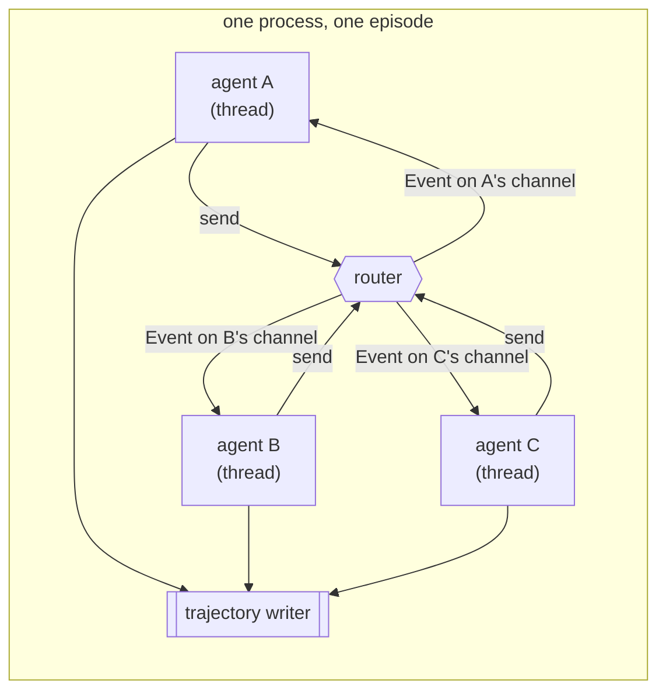

# ADR-0001: A single process per episode, one thread per agent

**Status:** Accepted
**Date:** 2026-09-17
**Deciders:** Bill McNeill

## Context

Social Deception is a framework for environments in which several LLM agents
interact in real time without turn-taking. Nothing hands out turns and no agent
is ever owed a move. At any moment an agent may speak or stay silent, and
staying silent is as much a decision as speaking. Time is real time: the seconds
an agent spends thinking, and the seconds a model provider spends answering, are
part of what the other agents observe. Latency is a property of the world being
simulated, not a defect to be hidden.

The unit of work is the **episode** — one run of an environment with a fixed
roster of agents, from coordinated startup to coordinated shutdown. The
long-term aim is to produce per-agent reinforcement-learning training data from
episodes. That means an episode must leave behind, for each agent separately, an
ordered record of what that agent perceived and what it did about it, with
timings good enough to reason about who knew what when.

A previous attempt at this project, in Python, ran each agent as its own OS
process, connected them through a NATS broker, and distributed episodes over a
worker pool. Almost everything difficult about that system was a consequence of
the process boundary rather than of the problem. Agents had to announce
themselves and be detected as missing, because a process can vanish; episodes
needed manifests so that a roster could be agreed upon across processes; reply
subjects had to be scoped per episode so that concurrent episodes did not
collide; and something had to spawn, watch and reap child processes at the
operating-system level. Message handlers were forbidden to block, because a
blocked handler stalled an event loop that was serving every agent in that
process. None of that machinery generated training data or made an agent's
behavior more interesting. It existed to make a distributed system work.

The question this ADR settles is what the runtime is: what a process is, what a
thread is, and how agents reach each other. The implementation language is Rust,
which is not the subject of this record and gets no record of its own for
now; it appears below only where it bears on the runtime — threads, channels,
blocking HTTP clients, and channel receives with timeouts.

Two observations narrow the answer considerably. First, the only real job the
multi-process design had was spreading load across machines, and load here is
episodes, not agents — an episode is a natural shard, self-contained by
definition. Second, training is per-agent. A policy is trained on one agent's
own stream of observations and actions, so the record needs a total order
*within each agent* and nothing more. There is no requirement anywhere in the
system for a single global order across all agents, and a global order is
precisely the guarantee that a broker with a persistent stream is bought for.

## Decision

**An episode runs as a single operating-system process. Each agent in the
episode owns one OS thread. All communication between agents, and between agents
and the rest of the runtime, is over in-process channels. There is no message
broker, no NATS or JetStream, no worker pool, no episode manifest and no
cross-process supervision.**

### An agent's life is a fold over one event stream

Every agent has exactly one receiver, and everything that can ever happen to
that agent arrives on it. In-world messages from other agents, control messages
from the runtime, and the agent's own internal "think" wake-ups are all variants
of one `Event` enum:

| Variant | Carries |
|---------|---------|
| `Message` | something said in the world, with its sender and recipients |
| `Control` | runtime instructions — start, stop, and their kin |
| `Think` | the agent's own internal prompting to reconsider |

The agent is then a fold: a loop that takes the current state and the next
event, and produces the next state plus whatever it chose to send. One receiver
is the agent's whole life, which means there is exactly one place where an
agent's behavior is defined and exactly one order in which it saw things
happen. That property is what makes an episode replayable and an agent testable,
and it is kept as a discipline even where the runtime no longer forces it.

### The router owns routing and nothing else

A router holds a map from agent id — a 𝕊 — to that agent's sender, and does
nothing else. Messages carry a recipient set: broadcast by default, or an
explicit set of agent ids. Application code addresses agent ids and never
touches transport; it cannot tell, and must not care, what a sender is made of.

Senders are unbounded. This is deliberate: with bounded channels, one agent slow
to drain its inbox applies back-pressure to the router, and through the router
to every other agent in the episode. A slow agent is a normal condition here — it
is an agent waiting on a model provider — and it must not be able to stall the
world.

### Blocking is allowed

Because each agent owns a thread rather than sharing an event loop, an agent
that blocks blocks only itself. Ordinary blocking HTTP is therefore an
acceptable way to call a model provider, and the rule inherited from the
asyncio design — that a handler must never block — is no longer a hard
constraint of the runtime. It survives only as far as the fold discipline above
makes it useful.

### Timers need no scheduler

The central question an agent asks in an environment without turns is "act, or
stay silent?", and it must ask it even when nothing has happened. That needs no
timer service. An agent waits on its own inbox with a receive timeout, in the
manner of `crossbeam-channel`'s `recv_timeout`; the timeout firing *is* the
decision event. An agent with several pending deadlines keeps a small heap of
them locally and waits until the earliest.

One detail matters enough to record: the deadline passed to the receive call is
always the *remaining* time until the next deadline, never the full interval. An
agent that reset a full interval after each message would have its own timer
pushed further away every time somebody spoke to it, and a busy agent would
starve the very decision the timer exists to force.

### Scaling is by episode, not by agent

Many episodes run concurrently inside one process, each with its own router and
its own threads. If throughput ever needs to grow beyond what one process can
hold, the answer is more processes, each running whole episodes, with no
messaging between them at all. Episodes do not talk to each other, so there is
nothing to distribute. In practice, provider rate limits are expected to be the
binding constraint long before CPU is: a roster of agents that spend most of
their time waiting on an API does not saturate a machine.

### The fold is the log

The earlier design's principle was that the wire is the log — the broker saw
everything, so the broker's stream was the record. With no wire, the principle
becomes **the fold is the log**: each agent's own event sequence is its
trajectory, recorded by the agent as it folds. Trajectories go over an
in-process channel to a writer, not published onto a transport where a slow
consumer could silently drop them.

Each recorded event carries two times: when it arrived on the agent's channel
and when the agent got round to handling it. The gap between them is how long
the agent was busy, which is exactly the quantity needed to reason about
timing-sensitive behavior, and it is free to collect. One process means one
clock, so these timestamps are directly comparable across agents with no skew
to correct. Times are taken from a monotonic clock and paired with a per-agent
sequence number, because two events can read the same instant and a training
record cannot tolerate a tie it has no way to break.

## Alternatives considered

### A broker with a process per agent and a worker pool

This is the previous architecture: NATS for transport, each agent in its own
process, episodes handed out to a pool of workers. Its real virtue is
isolation — a runaway or crashing agent is contained by the operating system,
and work genuinely spreads across machines. Against that, every piece of
machinery listed in the context above is a tax on the process boundary: a
presence protocol and lost-role detection because processes disappear,
manifests because a roster has to be agreed across them, episode-scoped reply
subjects because concurrent episodes share a flat subject space, and
child-process supervision because somebody has to own the children. Since
episode-level sharding delivers the distribution that was the only thing the
process boundary was actually needed for, all of that is cost without a
remaining benefit. It lost on that ledger.

### Core NATS with every agent as a thread or task in one process

This was the genuinely attractive alternative, and it deserves to be recorded as
such. Keeping one process but routing through core NATS means routing,
request/reply with timeouts, and slow-consumer handling are off-the-shelf and
have been hammered on by other people for years — none of it is code this
project would have to write or debug. It has a second real advantage: browser
viewers can speak NATS over WebSocket directly, so the remote-participant
problem solves itself and no gateway needs writing.

It lost on four counts. NATS is written in Go and has no embeddable Rust server,
so a separate `nats-server` process must be running for anything to work at all,
including every test. It serializes and deserializes every message between
threads that share an address space, which is work done purely to satisfy the
shape of the transport. Core NATS may drop messages to a slow consumer, and the
log does not necessarily show that it happened — for training data, a silently
incomplete record is worse than a loudly broken one. And closing that gap means
JetStream, which buys a global total order across agents that per-agent training
does not need, at the cost of streams, consumers, acks and retention policies
present in every debugging session. Paying a broker's price for a guarantee the
problem does not require is the decisive point.

### A general in-process pub/sub layer

Rather than a plain router, the runtime could offer subject wildcards, dynamic
subscribe and unsubscribe, and pattern-matched delivery — broker semantics
without a broker. Rejected as premature generality. An episode's topology is
fixed when the episode starts: the roster is known, it does not change, and
agents do not discover each other. A fixed roster plus an explicit recipient set
covers every case that exists today. A general subscription layer would be
speculative machinery whose only likely future is to accumulate features until
it is a worse broker than the ones already available.

## Consequences

- **Isolation is weaker than with separate processes.** A panicking thread can
  be caught and reported, but an agent stuck in a tight CPU loop cannot be
  killed from inside the process. There is no way to fence that off without
  reintroducing the process boundary, so it is accepted rather than mitigated.

- **Thread count is a real ceiling.** Each thread reserves stack, so a few
  hundred agents across the episodes in one process is comfortable and
  thousands of concurrent episodes is not. That is stated as the known limit of
  this design, and the point at which agents would have to become async tasks
  instead of threads — not as a plan to do so.

- **Episodes in one process share a thread scheduler.** Under heavy load,
  scheduling delay appears as queue wait, and queue wait is part of what the
  agents in that episode observe. Episodes that ought to be independent can
  therefore nudge each other's timing. The per-event arrival and handling times
  recorded above make this visible in the data rather than invisible; if it
  shows up, the remedy is a cap on episodes per process.

- **Remote participants now need an explicit gateway.** Browser viewers,
  humans, and agents not written in Rust no longer get a transport for free;
  something — a WebSocket endpoint or similar — has to translate between
  in-process channels and the outside world. This is the main piece of work
  this decision defers, and it is named here rather than designed here.

- **Tests need neither a broker nor a subprocess fixture.** An episode is
  constructed, run and asserted on in the test process. For deterministic
  timing, an agent's timer source is itself a channel: in production it is
  driven by real elapsed time, and in tests it is driven by the test, so timing
  behavior can be exercised without sleeping.

- **The decision is reversible.** The fold does not care whether an event
  arrived from a channel or a socket. If distribution requirements change, a
  transport can be put behind the router without the agents noticing.

## Deliberately deferred

These are named so that they are not mistaken for oversights. None is decided
here.

1. **The remote participant gateway** — how browser viewers, humans and
   non-Rust agents join an episode.
2. **Application registration and configuration** — how an environment and its
   roster are declared and found.
3. **Cross-process episode distribution** — the mechanics of running episodes
   on more than one machine, should throughput ever demand it.
4. **The on-disk trajectory format** — what the writer actually writes.
5. **Reward definition** — how an episode's outcome becomes a training signal.
