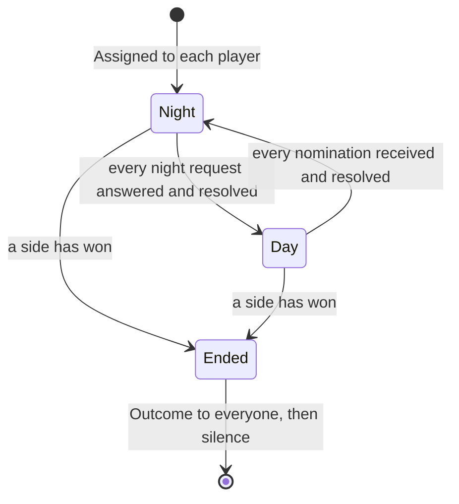

# ADR-0004: A moderator agent runs the game, and the seam with the episode is construction

**Status:** Accepted
**Date:** 2026-09-18
**Deciders:** Bill McNeill

## Context

The runtime of [ADR-0001](0001-single-process-thread-per-agent.md) can
already run an environment end to end: a fixed roster of agents, each a
thread folding over its own event stream, a router delivering to explicit
recipient sets, and an episode that stops when it goes quiescent. A Collatz
ring exercises all of that in the test suite.

Werewolf is the first environment with rules, and it brings four things the
Collatz ring does not have:

- **Phases.** Night and day alternate, and what a player may do depends on
  which it is.
- **Hidden information.** Werewolves know each other; villagers do not know
  who the werewolves are; the seer learns one fact per night that nobody else
  learns.
- **A termination condition no agent can evaluate locally.** A villager
  cannot see the night kill, so it cannot tell whether the game is over.
- **An outcome that is the reward signal.** Which side won is the number
  every agent's trajectory exists to carry.

The question is where the game lives: who owns the phase, who decides what an
agent may do, and what the runtime has to learn about games.

## Decision

**The game is a state machine owned by a `Moderator`, an ordinary agent in
the roster. The runtime learns nothing about Werewolf. The seam between the
game and the episode is episode construction: a function takes a
configuration and hands back a populated episode. `Episode`, `Agent`,
`Router`, `Event` and the trajectory format do not change behaviourally.**

### The game is a pure fold and the moderator is a thin shell around it

`Game` holds the rules and nothing else: no channels, no threads. `begin`
produces the opening narrations and requests; `record` takes one player's
response and produces whatever that response caused; `outcome` reports the
winner once there is one. `Moderator` is the `Handler<Message>` around it,
turning arriving events into calls on the fold and sending what the fold
returns.

### Roles are assigned at setup, not dealt at runtime

There is a Rust type per player type, and a Rust type is fixed at
construction, so a role cannot be dealt by a message. Roles are assigned by
a deterministic shuffle from the master seed before the episode runs, and the
typed players and the moderator are built from that one assignment.

The moderator still narrates `Assigned` to each player on `Control::Start`.
The agent's own event stream is what training consumes and what a future LLM
policy will read its role from, so the assignment must appear there. The
narrated role and the player's type must agree; a mismatch is a wiring bug
and fails loudly rather than playing a quiet, wrong game.

### The moderator never broadcasts, except once

`Recipients::Broadcast` resolves to the whole roster minus the sender. A
broadcast would reach dead players and, at night, villagers who must not
hear. Every moderator message therefore carries an explicit recipient set —
one player, the living, or the pack — and that choice of recipients is the
whole of the hidden-information mechanism.

The single exception is the final `Outcome`, broadcast on purpose. It is the
reward signal, and a dead werewolf whose pack went on to win needs to observe
that it won.

A dead player receives the announcement of its own death, then nothing until
that final `Outcome`. Its trajectory ends clean, without observations it
could not act on.

### The game ends by silence

When the win condition is met the moderator announces the outcome and says
nothing more. The players reply nothing, the episode goes quiescent, and it
stops and joins its threads. No new shutdown mechanism is needed. Episode
assembly treats an episode that goes quiescent without an outcome as an
error.

### Resolution is order-independent

The moderator advances exactly when no request is outstanding. It
accumulates responses into a map keyed by the responding agent and resolves
the phase in a canonical order over that map, so which thread answered first
has no effect on the result.

### The outcome reaches the caller on a channel

`Episode::run` consumes its roster and drops the handlers it joins, so the
moderator's final state is unrecoverable from it. The moderator is built with
a `Sender<Outcome>` and publishes there as well as announcing in world; the
caller holds the receiver. This is an observation channel, not a control
channel: the in-world announcement stays the record of truth, and the value
on the channel must equal it.

### One `Faction` serves both investigation and victory

What a seer learns about a player and what a winning side is are the same
partition of the roster, so they are one type.

### The rules of this Werewolf

Several of these are choices among standard variants.

- **Night first.** Phases alternate Night 1, Day 1, Night 2, Day 2, and so
  on.
- **Night.** Every living werewolf devours, the living seer investigates, the
  living doctor protects. All requests are issued in one pass and resolved
  in a fixed order: the night tally goes to the living werewolves; the victim
  is the plurality of the werewolves' actions; the doctor's protection is
  applied; the seer is told its result privately; a death or no death is
  announced to the living.
- **Day.** Every living player nominates. The plurality is lynched, so the
  day always eliminates someone and the living set strictly shrinks every
  round even when the doctor saves.
- **Plurality with a seeded tie-break.** Ties are broken by the moderator's
  own seeded generator among the tied, drawn only when there is actually a
  tie.
- **No action targets the agent taking it.**
- **The doctor may not protect itself, nor the same player two nights
  running.** That is private state constraining what the doctor may do,
  which is why the role is in the first version.
- **A death reveals the role.**
- **The day's tally is public; the night's goes to the pack.** The full day
  tally is narrated to the living; the night tally to the living werewolves
  only.
- **A save is never announced.** A protected victim yields "no one died",
  never "someone was saved". The doctor knows whom it protected and hears
  that nobody died, so it may infer; it is never told.
- **Parity win condition.** Werewolves win when living werewolves are at
  least as many as living non-werewolves; the village wins when no werewolf
  lives. Checked after every elimination. Parity rather than annihilation,
  because from parity onward the werewolves cannot lose.
- **A round cap** guards against a future stalling policy; the day's
  elimination already guarantees termination.

## Alternatives considered

### A state machine outside the episode, driving it

The game could sit beside the episode and push phases into it. Rejected
because it puts game knowledge into the runtime: "who may speak now" becomes
a router concern, and every future environment would inherit a runtime
shaped by Werewolf.

### The rules replicated in every agent, with no central authority

Each player could carry the full rule set and work out the phase for itself.
Rejected because it founders on hidden information: no single agent observes
enough to resolve a night. Somebody has to see every night action to decide
who died, and that somebody is the moderator.

### Recovering the outcome by re-reading the trajectory

The caller could open the trajectory file just written and find the outcome
in it. Rejected as awkward for a command-line run, and as making the caller
depend on the file format for a value the game already holds in memory.

### Returning the handlers from `Episode::run`

`Episode::run` could hand back its handlers so the caller could ask the
moderator for the outcome. Rejected because it needs `Any` downcasting out of
`Box<dyn Handler
>`, and because it changes the runtime for the sake of one
environment.

### An `Alignment` type beside `Faction`

A second type could distinguish what an investigation reports from which side
a player wins with. Rejected because nothing in this version distinguishes
them. Two extensions would, and either is the moment to split the type:

- a **solo-win role** such as a Tanner, who wins by being lynched, at which
  point winning sides and investigation results stop being the same set;
- a **falsely-investigating role** such as a Lycan, who reads as a werewolf
  to the seer, at which point an investigation becomes a report rather than a
  fact.

## Consequences

- **The runtime is untouched.** Werewolf is one directory that builds an
  episode. Nothing in `Episode`, `Agent`, `Router`, `Event` or the trajectory
  writer knows a game is being played.
- **The rules are unit-testable.** A test of the night resolution is a call
  to `record` with values and an assertion on values; no thread, channel or
  episode is involved.
- **No player's observations depend on which thread answered first,**
  because a player never observes another player's response while its own is
  open. Together with canonical-order resolution, that is what lets
  [ADR-0005](0005-policy-separates-decisions-from-rules.md) claim a
  deterministic transcript on threads that are not deterministic.
- **A truncated game is a short trajectory, not a hang.** Some player failed
  to respond, the moderator is waiting for a reply that never comes, and
  nothing is in flight. That is the failure mode to look for, and a checker
  can assert that every trajectory's last narration is an `Outcome`.
- **A new message kind must name its recipients.** There is no default.
- **The moderator's id shares the players' namespace,** so configuration
  validation rejects a player with that name.

## Deliberately deferred

Named so that it is not mistaken for an oversight. Not decided here.

1. **Timers and quiescence.** They are currently mutually exclusive:
   `Episode::run` hard-codes `think_every: None` for every agent, and an
   agent that wakes on its own would keep an episode from ever going
   quiescent. Deterministic Werewolf needs no timers. Real-time dialogue
   will, and at that point "when is the episode over?" needs a different
   answer, most likely the moderator declaring it.
