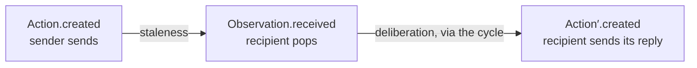

# ADR-0007: The framework speaks the vocabulary of reinforcement learning

**Status:** Accepted
**Date:** 2026-09-24
**Deciders:** Bill McNeill
**Supersedes:** [ADR-0003](0003-event-record-stamps.md)
**Amends:** [ADR-0002](0002-jsonl-trajectory-format.md),
[ADR-0004](0004-moderator-agent-runs-the-game.md),
[ADR-0005](0005-policy-separates-decisions-from-rules.md)

## Context

The trajectories this project produces exist to train policies, and the
people and code that consume them think in the terms of reinforcement
learning: an agent observes, acts, and is rewarded by an environment over
the course of an episode. The code grew its own words for these things
instead. The runtime's `Event` is one enum covering in-world messages,
runtime instructions and timer wake-ups. The reward signal is a narration,
`Outcome`, broadcast to every player. The word *action* names Werewolf's
choice of target, not what an agent emits. The environment is an ordinary
agent, `Moderator`, that the runtime knows nothing about. ADR-0003's
`arrived`, `sent` and `due` stamps were already distinguishing observation
from action from wake-up, without naming them as such.

Each translation between the code's words and the ones the trajectories are
read in is a place to get something wrong. This record adopts the
reinforcement-learning vocabulary for the framework and states what each
term means here, where that differs from the textbook, and what changes in
the runtime, the trajectory format and Werewolf as a result.

## Decision

**The framework's nouns are `Agent`, `Environment`, `Event`, `Control`,
`Reward`, `Observation` and `Action`, with the meanings below. `Event` and
`Control` are what travels on the wire; `Observation` and `Action` are the
same data as seen from one agent; `Reward` never travels at all.**

### The vocabulary

| Term | Meaning |
|------|---------|
| `Agent` | As before: a thread with a queue, folding what it pops into its own state and emitting actions. |
| `Environment` | A distinguished agent that controls the episode. One per episode. The only agent that may send a `Control` or log a `Reward`. |
| `Event` | In-domain data on the wire: sender, recipients, creation time and the environment's payload. |
| `Control` | Out-of-domain data on the wire, such as the instruction to stop. |
| `Reward` | A single number the environment assigns to one agent. Logged, never sent. |
| `Observation` | An `Event` popped off an agent's queue. |
| `Action` | An `Event` an agent sends outside itself. |
| Cycle | One turn of an agent's loop: pop what is waiting, hand it to the handler, send what the handler returns. |

`Observation` and `Action` are relative to an agent. On the wire there are
only `Event`s and `Control`s; the same `Event` is an `Action` of its sender
and an `Observation` of each recipient.

An `Event` may go directly from one agent to another or be routed through
the environment, which receives it and emits events of its own. Which one a
scenario uses is the environment's design, not the router's: the router
delivers to the recipient set it is given and knows nothing about routes.

**Cycle** is the only name for one turn of the loop. Earlier records and
comments also say *pass*; they mean a cycle, and the code is to use
*cycle* throughout.

### A domain names a game's types

An environment defines the payload its events carry and the numeric type of
its rewards. Rewards may be integers or reals, so the reward type is a
parameter. Rather than thread two type parameters through every runtime
type, one trait names both:

```rust
pub trait Domain: 'static {
    type Payload: Payload;
    type Reward: Serialize + Copy + Send + 'static;
}
```

The runtime is generic over `D: Domain`. The trait carries no behavior; it
names a set of types, as `Payload` names a bound. The reward type is only
carried and serialized, so it needs no arithmetic bound.

### The environment is a trait, implemented per game

The framework defines `Environment`. A game implements it under whatever
name suits the game: Werewolf's is `Moderator`, which keeps its name. The
environment's agent id is configurable; Werewolf's configuration defaults it
to `"moderator"`.

An environment's handler may return, besides events, controls addressed to
agents and rewards assigned to agents. An ordinary agent's handler returns
only actions. The difference is in the types, so an ordinary agent cannot
send a control or log a reward, and the router rejects a control whose
sender is not the environment.

Two environments exist from the start: Werewolf's `Moderator`, and a trivial
one for the Collatz test ring that starts the ring and stops it. The second
is what justifies a framework-level trait; with one implementor it would be
the premature generalization ADR-0005 warns against.

### The environment controls the episode

The episode delivers `Start` to the environment. The environment starts the
agents by sending each of them `Start`, and ends the episode by sending each
of them `Stop`; once every agent has stopped, the episode stops the
environment and joins the threads.

Quiescence stops being how an episode ends and becomes how a stalled one is
detected. An episode that goes quiescent before its environment has sent
`Stop` is an error.

A `Start` the environment asks for is issued **before** that cycle's events,
so that an agent logs its start ahead of its first observation. A `Stop` is
issued **once nothing is in flight**, which is to say once everything
already said has been handled. It has to be: an agent that pops a `Stop`
leaves the events still on its queue unpopped, because an agent that has
stopped did not observe them, so a `Stop` racing a delivery would swallow it
and which deliveries were swallowed would depend on the scheduler. Holding
the stop back until the in-flight count reads zero makes "an agent hears
everything said to it before it is told to stop" a guarantee, and it is what
lets the moderator narrate an outcome to the living and end the episode in
one cycle.

Controls are out-of-domain, so the handler does not see them. The loop logs
every control and acts on it: `Start` makes it call the handler's start
hook, which returns the agent's opening actions and by default returns
none; `Stop` makes it exit after logging.

### Controls have their own queue and preempt a cycle

Each agent has two queues, one for events and one for controls. At the top
of every cycle the loop takes controls before events, so a `Stop` is acted
on before any event queued behind it.

A control must also be able to take effect in the middle of a cycle, while
the handler is blocked on a slow policy. Rust cannot kill a thread, so
preemption is cooperative and costs no thread. The handler receives a
`Cancel`:

```rust
fn handle(&mut self, observations: &[Observation<D>], cancel: &Cancel) -> Vec<Action<D>>;
```

When the router puts a control on an agent's control queue it trips that
agent's `Cancel` in the same step. `Cancel` wraps a channel that is closed
when it trips, not only a flag, so that a policy blocked on a result can
wait on the result and the cancellation together and wake on whichever
comes first.

A cycle preempted by `Stop` sends nothing. Whatever the handler returns is
dropped, and each dropped action is logged as dropped, so that the
trajectory shows the agent was mid-decision when the episode ended and a
training pipeline can exclude the truncated decision. `Stop` is the only
control there is. A future control that preempts without ending the episode
decides for itself what happens to the preempted cycle's actions.

### Model-backed policies stream and honor cancellation

A policy that calls a model makes the call on its own thread, streams the
response, and waits on the stream and its `Cancel` together. On
cancellation it closes the connection, so that generation stops rather
than running to completion unread. The same wait enforces the per-call
deadline after which, as ADR-0005 requires, the policy falls back to
`RandomPolicy`. No model-backed policy exists yet; this is the requirement
the first one is written against.

### The loop's timeout stays

An agent's wiring keeps its optional timeout, with `None` meaning none; the
episode still configures `None`. What changes is what a timeout produces.
`Event::Think` is removed, because it is neither in-domain data nor out of
domain nor anything that traveled. A timeout instead runs a cycle with no
observations, and the cycle record says it was woken by the timeout.

What the agent queues for itself — thoughts — are deferred. When they
arrive they will be observations whose origin is the agent itself, and a
timeout may become one way of producing one.

### Rewards are logged, not sent

An agent never needs to observe its reward while acting; the reward is for
training. So a reward is not a message. The environment logs a reward
record naming the agent it is assigned to, and training joins it to that
agent's trajectory by agent id.

### Timestamps

Every observation, action and control is timestamped, with a creation time
and, where the object is received by anyone, a receipt time. Two traits
standardize them. `Timestamp` remains the type: nanoseconds since the
episode clock started.

```rust
pub trait Created {
    fn created(&self) -> Timestamp;
}

pub trait Timestamped: Created {
    fn received(&self) -> Timestamp;
    fn latency(&self) -> Duration { self.received() - self.created() }
}
```

| Object | `created` | `received` | Implements |
|--------|-----------|------------|------------|
| `Event`, as sent | the instant the agent sent it | — | `Created` |
| `Observation` | the sent `Event`'s `created`, carried through | the instant it was popped off the queue | `Timestamped` |
| `Control` | the instant the environment sent it | the instant it was popped off the control queue | `Timestamped` |
| `Reward` | the instant the environment logged it | — | `Created` |

A handler returns `Action`s: recipients and a payload, nothing more. An
action has no creation time until it is sent, and the handler cannot know
that instant, so the loop stamps each action with its sender and `created`
as it sends it, and the stamped action is the `Event` on the wire. That is
why `Created` belongs to the sent `Event` (and to the `action` record that
logs it) rather than to the `Action` value the handler returns. When this
record speaks of an action's `created`, it means that stamp. There is no
separate outgoing-message type.

An observation's latency is its whole staleness: routing plus
waiting in the queue, the delay the agent actually suffers. The moment it
entered the queue is not recorded; ADR-0002 already observed that in a
single process arrival is send time plus scheduler jitter.

How long an agent deliberated is not a latency of any one object. It is an
action's `created` minus the `received` of the observations in the same
cycle, and the cycle record is what groups them.



### What is logged, and when

An agent logs an action the instant it sends it, with its `created`, and an
observation or a control the instant it pops it, with both times. The
environment logs rewards. The record types become:

| `type` | Written by | Fields |
|--------|-----------|--------|
| `observation` | the agent, on pop | `agent`, `seq`, `created`, `received`, `event` |
| `action` | the agent, on send | `agent`, `seq`, `created`, `event` |
| `dropped` | the agent, when `Stop` preempts a cycle | `agent`, `seq`, `created`, `event` |
| `control` | the agent, on pop | `agent`, `seq`, `created`, `received`, `control` |
| `reward` | the environment | `agent`, `created`, `value` |
| `cycle` | the agent, at the end of the cycle | `agent`, `t_start`, `t_stop`, `woken`, `inputs`, `outputs` |

`agent` is always whose trajectory the record belongs to; a reward record
belongs to the agent rewarded, though the environment writes it. A reward
has no `seq`, because sequence numbers are the agent loop's to assign.
A dropped action's `created` is the instant the handler returned it.
`woken` is `queue` or `timeout`.

A sample, replacing ADR-0003's:

```json
{"type":"control","agent":"alice","seq":0,"created":10,"received":12,"control":"start"}
{"type":"cycle","agent":"alice","t_start":12,"t_stop":13,"woken":"queue","inputs":[0],"outputs":[]}
{"type":"observation","agent":"alice","seq":1,"created":40,"received":55,"event":{"sender":"moderator","recipients":["alice"],"payload":{"Request":{}}}}
{"type":"action","agent":"alice","seq":2,"created":90,"event":{"sender":"alice","recipients":["moderator"],"payload":{"Response":{}}}}
{"type":"cycle","agent":"alice","t_start":55,"t_stop":90,"woken":"queue","inputs":[1],"outputs":[2]}
{"type":"reward","agent":"alice","created":500,"value":1}
```

Everything else ADR-0002 says about ordering, sequence numbers and the
on-disk format stands.

### What this means for Werewolf

- **`Move` is the choice; `Action` is the message.** The framework's
  `Action` is an event an agent sends, and a game defines its payload as it
  sees fit. Werewolf's enum of targets and abstentions, formerly `Action`,
  becomes `Move`, and a player's action is the `Response` event carrying
  one. The action space is a `Vec<Move>`; everything ADR-0005 says about it
  holds with that substitution.
- **`Knowledge` is unchanged.** A `State` container for all of an agent's
  state is deferred; see below.
- **The reward is +1 for each player on the winning faction and −1 for each
  on the losing one,** living or dead, logged when the game ends and before
  `Stop`.
- **There are no stalemates.** A `Nominate` cannot abstain, so every day
  eliminates someone and the game ends within as many rounds as there are
  players. The round cap, the `max_rounds` setting and the stalemate are
  removed, and `Outcome.winner` is a `Faction` rather than an
  `Option<Faction>`.
- **The broadcast exception is withdrawn.** ADR-0004 broadcast the final
  `Outcome` to every player because it was the reward signal. It no longer
  is. `Outcome` is narrated to the living like any other narration, and a
  dead player's trajectory ends at the announcement of its own death, its
  reward and `Stop`.

ADR-0005's vocabulary table now reads: the observation is an
`Observation` of a `Message`; the state is `Knowledge`; the action is an
`Action` whose payload is a `Response` carrying a `Move`.

## Alternatives considered

### Send the reward to the agent

A reward message on a third queue. Rejected because nothing reads it: a
policy acts on observations, and the reward is consumed by training, which
reads the log. Sending it would add a message kind with no consumer and a
queue to drain at shutdown.

### Controls on the event queue

The present design. Rejected because a control queued behind a batch of
events waits for them, and a `Stop` behind a slow cycle waits for the
cycle.

### Preempt by running the handler on a worker thread

The loop could run each `handle` on a second thread and wait on the control
queue and the result together. Rejected because it costs a thread per agent
and still cannot stop the work: an abandoned model call runs, and bills, to
completion. The policy has to cooperate either way, and cooperation alone
costs nothing.

### Send a preempted cycle's actions

Rejected. After `Stop` the recipients have stopped too, so the actions go
nowhere, and they are typically a fallback's choice rather than the
policy's, which would put a decision in the trajectory that the agent did
not make.

### An observation created when it entered the queue

Rejected in favor of carrying the sender's send time, so that an
observation's latency is its full staleness without joining records across
trajectories. Separating routing from queuing would need the enqueue time,
and in one process routing is microseconds.

### An action created at the start of its cycle

This would make each object's `received` the next one's `created`, and an
action's latency its deliberation time. Rejected because an action is
created when it is sent; deliberation is recoverable from the cycle record
without bending the meaning of `created`.

### A second type parameter for the reward

`Episode<P, R>` and so on. Rejected in favor of `Domain`, because the two
always travel together and every future per-game type would otherwise be
another parameter on every signature.

### Rename `Moderator` to `Environment`

Rejected. `Environment` is the framework's role and `Moderator` is
Werewolf's name for its implementation of it, which is also the name a
language-model player will read in its prompt.

### A `State` container now

Deferred rather than rejected. It is not yet clear that an agent's state
falls out naturally as one structure, and ADR-0005's claim that `Knowledge`
is a sufficient statistic would need restating if `State` held a policy's
private state as well.

## Consequences

- **The trajectory format changes,** and the Werewolf fixtures are
  regenerated. No Python yet reads a trajectory, so the contract ADR-0002
  mentions has no reader to break.
- **The logical transcript is unchanged** for every configuration and seed,
  apart from `Action` reading `Move` and the stalemate no longer existing.
  That is the regression check for the whole rewrite.
- **A checker can assert more.** Every agent's trajectory begins with a
  `Start` control and ends with a `Stop` control; every player has exactly
  one reward record; a `dropped` record appears only in a cycle that popped
  `Stop`.
- **Every handler takes a `Cancel`.** `RandomPolicy` never blocks and
  ignores it. A policy that blocks and ignores it makes `Stop` wait for it,
  which is a bug in that policy, not in the runtime.
- **Two environments implement the trait,** and the reward half of its
  interface has only one real user. It should be expected to move when a
  second game arrives.
- **Nothing in the runtime knows a game is being played,** as ADR-0004
  required. What it now knows is that every episode has an environment.

## Deliberately deferred

1. **`State`,** a container for all of an agent's state.
2. **Thoughts,** events an agent queues for itself.
3. **A model-backed policy.** Its streaming and cancellation requirement is
   decided above; the policy is not.
4. **Controls other than `Start` and `Stop`,** and what a non-terminal
   preemption does with its cycle's actions.
