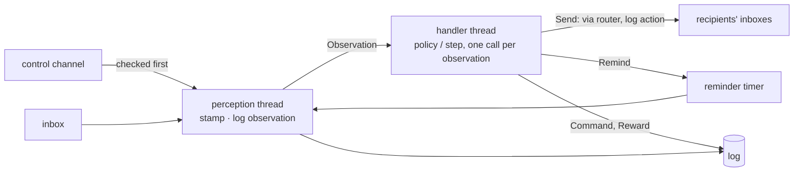

# ADR-0016: Actors perceive on one thread and decide on another

**Status:** Accepted
**Date:** 2026-09-28
**Deciders:** Bill McNeill
**Supersedes:** [ADR-0009](0009-one-queue-and-no-cancellation.md)
**Amends:** [ADR-0001](0001-single-process-thread-per-agent.md),
[ADR-0007](0007-reinforcement-learning-vocabulary.md),
[ADR-0008](0008-one-observation-per-cycle.md),
[ADR-0010](0010-a-handler-sets-its-own-deadline.md)
**Depends on:** [ADR-0017](0017-messages-carry-a-sequence-number-and-the-log-keeps-the-time.md)

## Context

Today each agent is one thread running one loop: pop from its single queue
(ADR-0009), hand at most one observation to the handler (ADR-0008), send what
the handler returns, ask the handler for its next deadline (ADR-0010), repeat.
The episode sits in the middle, routing everything every agent sends and
counting deliveries in flight so that it can tell a finished episode from a
stalled one.

That shape was built and tested against scripted policies that answer in
microseconds. Werewolf's primary setup is LLM players, whose policy calls take
seconds, and two things go wrong once they do.

**Perception stops while the agent thinks.** A thread blocked in a model call
pops nothing. Everything said during the call is popped when the call returns,
at nearly the same instant, and is logged and observed as arriving then. An
agent's sense of time is the times at which its observations arrive
([ADR-0017](0017-messages-carry-a-sequence-number-and-the-log-keeps-the-time.md)),
so the loop erases the spacing of the conversation exactly when the
conversation is busiest — which is the information the when-to-speak problem
most needs.

**The runtime surface is large for what it does.** An agent's behavior is
spread over four hooks on `Handler` (`start`, `handle`, `timeout`,
`deadline`), a parallel `Environment` trait, an `Adapter` between the two,
`Wiring` with seven fields, `CycleDispatch`, and `TimerSource` with a
`ManualTimer` that only `agent.rs`'s tests use. `Agent` itself is only a
thread handle. Most of `episode.rs`'s 1,442 lines are the central routing loop
and the quiescence count.

What is right about today's shape is the handler's signature: an observation
in, actions out. Somewhere in any reinforcement learning system there is a
function of that shape, and this record keeps it at the center.

ADR-0009 considered and rejected running the handler on a worker thread,
because "it costs a thread per agent and still cannot stop the work." That
objection was to a worker thread as a *cancellation* mechanism, and it still
stands: nothing here cancels a model call. The reason for a second thread in
this record is different. It is so that perceiving never waits on deciding.

## Decision

**Every participant in an episode is an `Actor`: a perception thread that
receives and timestamps, and a handler thread that calls one application
function per observation and sends what it returns. `Agent` and
`Environment` are roles. An agent implements `policy`, from an observation to
actions; an environment implements `step`, from an observation to effects.**

### Vocabulary

| Term | Meaning |
|------|---------|
| `Actor<R, H>` | A running participant: its id, the sender for its control channel, and the join handles of its two threads. `join` returns the handler. |
| `UnstartedActor` | An actor whose inbox exists but whose threads do not, so that an episode can wire every inbox before anyone runs. |
| `Agent`, `Environment` | The two roles. Werewolf's `Player` and `Moderator`. |
| `Message` | What travels between actors: sender, sequence number, recipients, payload. Renamed from `Event`. |
| `Observation` | A message coming in, with the instant it arrived. What a handler is called with, and what the receiver logs. |
| `Action` | What an agent does: send a message, or set a reminder. What a policy returns, and what the sender logs. |
| `Effect` | What an environment does: an action, a control, or a reward. What `step` returns. |
| `Envelope` | An address in space: a received message's origin and payload, so that an environment can relay it without losing who said it. |
| `Reminder` | An address in time: a payload and a deadline, delivered back to the actor that set it as an ordinary message. |
| `Control` | Out-of-domain instructions (`Start`, `Stop`), on their own channel. Never seen by a handler. |
| `Context` | Runtime-internal: the per-actor plumbing (id, router, log sender, sequence counter). No application code sees it. |
| `Router` | The shared, fixed-roster map from actor id to inbox sender, as ADR-0001 describes. |
| `Episode` | The owner of one run: wiring, threads, the log writer, a time limit, joining. |
| `Clock` | The episode's one origin, chosen before any actor starts and shared by every actor and the log writer (ADR-0017). |

The runtime layer takes its names from the actor model so that the RL names
stay exact at the layer above: an agent chooses actions, an environment
applies rules and assigns rewards, and neither is "a special kind of the
other."

### The contract

```rust
pub struct Observation<P> { pub at: Instant, pub message: Message<P> }

pub enum Action<P> {
    Send { to: Vec<ActorId>, payload: P },
    Remind(Reminder<P>),
}

pub enum Effect<W, P> {
    Act(Action<P>),
    Command { to: Vec<ActorId>, control: Control },
    Reward { to: ActorId, reward: W },
}

pub trait Policy<P> {
    fn start(&mut self, clock: Clock) -> impl IntoIterator<Item = Action<P>> { [] }
    fn policy(&mut self, observation: Observation<P>) -> impl IntoIterator<Item = Action<P>>;
}

pub trait Step<W, P> {
    fn start(&mut self, clock: Clock) -> impl IntoIterator<Item = Effect<W, P>> { [] }
    fn step(&mut self, observation: Observation<P>) -> impl IntoIterator<Item = Effect<W, P>>;
}

pub struct Message<P>  { pub from: ActorId, pub seq: u64, pub to: Vec<ActorId>, pub payload: P }
pub struct Envelope<P> { pub from: ActorId, pub seq: u64, pub payload: P }
pub struct Reminder<P> { pub deadline: Instant, pub payload: P }
```

A handler is called **once per observation**, which keeps ADR-0008's rule.
It takes the observation by value, so a handler that keeps a history moves
it there. The runtime keeps no history on a handler's behalf: a reactive
policy, π(a | o), keeps nothing; a history-dependent one, π(a | h), keeps its
own *h*, including the actions it returns, and any window, summary or belief
state it builds from it.

An action is **intent**: recipients and a payload, with no sender, sequence
number or time. The runtime supplies those when it turns the action into a
message and logs it. The facts live in the log.

The roles differ in their return types. An agent cannot command or reward
because `Action` has no variant for either; the compiler says so. The
router's check that only the environment sends controls stays as a backstop.

**`start` is the one optional hook.** Handlers run only when an observation
arrives, so something must speak first — the moderator opening night one, the
first sender in a Collatz ring — and the framework cannot construct a game's
payload to prompt it. `start` is called once, when the actor receives
`Start`, and defaults to doing nothing. It is given the episode's `Clock`
([ADR-0017](0017-messages-carry-a-sequence-number-and-the-log-keeps-the-time.md)):
the one origin the episode chose before any actor started, shared by every
actor and the log writer, so that a handler measuring time from the start of
the game is on the log's timeline.

### Actions are sent as they are yielded

The handler thread sends each action as the iterator yields it, not after the
handler returns. A policy that returns a `Vec` sends everything at the end;
one that returns a lazy iterator can yield an action, do slow work inside
`next()`, and yield another. An LLM player streaming its model's response
can yield each piece of speech as it arrives, and its listeners hear the
utterance while the model is still generating it. The iterator borrows the handler, so the traits
are not usable as `dyn`; `Actor<R, H>` is generic over the handler, so
nothing needs them to be.

### Batching is the agent's own state machine

The runtime never batches, and it does not tell a handler what is waiting
behind the current observation. An agent sees its observations one at a
time, as a person hears a conversation one utterance at a time, with no view
into its own queue.

An agent that wants to decide from several observations at once — an LLM
player that should make one model call for five messages rather than five —
does it with its own state. The usual shape is to wait for a lull: fold each
observation into its state, set a reminder a short interval ahead, and
decide when a reminder arrives with nothing newer folded since it was set.
Werewolf's selection sessions already close this way, on a quiet period that
any new selection restarts. How an agent batches, and whether it does at all, is
its own business; the framework offers no mechanism for it.

### Recipients

A message's recipients may be **empty**: an action need not be directed at
anyone, and one addressed to nobody is still logged. The router's rule that
an empty recipient set is a bug goes; its other checks stay.

A message's recipients may **not** include its sender. The router keeps its
rule that there is no loopback. An actor that wants to send itself a message
sets a `Reminder`, which is the one way a message reaches the actor that sent
it. An actor that wants to remember its own actions keeps them in its own
state; the runtime never hands a handler back what it did.

### Relaying keeps the origin

An environment that relays what one actor said to others sends a new message
of its own, with its own sequence number. So that the origin is not lost,
the game's payload carries an `Envelope::of(&message)`: the original sender,
sequence number and payload. The framework provides the type and never looks
inside it; a game decides which of its payloads embed one.

### Reminders

An action `Remind(Reminder { deadline, payload })` is handed to the actor's
own perception thread, which holds it on its timer. At the deadline, the
payload is delivered back to the actor as an ordinary message from itself,
with the sequence number the reminder was given when it was set, and the
actor observes it like any other message. The payload says why the reminder
was set, so there is no wake-up type and no question of what to do with one.

- **A reminder is always self-directed.** Another actor cannot decide when
  you think; it can only send you a message asking you to, and your handler
  may answer with a reminder of its own. `Reminder` has no recipients.
- **The deadline is required.** A reminder is the only way to send oneself
  a message, so one wanted at once is simply a reminder whose deadline is
  now.
- **Reminders accumulate.** Each fires once. A handler that has changed its
  mind ignores a stale reminder when it arrives; nothing is cancelled. This
  replaces `Handler::deadline` and ADR-0010's single deadline.

An environment's timers are reminders too. The moderator does not schedule
"night falls" for its players; it reminds itself, and when the reminder
arrives it decides whether night falls — which it may not, if the game has
already ended.

In production the timer is fed by `crossbeam_channel::at`. In tests it is an
ordinary channel the test holds the sender of, so timed behavior is tested
deterministically without a trait.

### The two threads



The **perception thread** does only fast work: receive, stamp with
`Instant::now()`, log the observation, forward it. `crossbeam`'s `select!`
chooses at random among ready channels, so the loop checks the control
channel before every `select!`, and a waiting control always goes first.

The **handler thread** receives observations one at a time, calls the
handler with each, and carries out
each action or effect as it is yielded: a send goes through the router to
each recipient's inbox and is logged as an action; a reminder goes to the
perception thread's timer; a command goes to its recipients' control
channels; a reward goes to the log.

An actor has **one call in flight at a time**. Two policies running at once
for one agent would be two handler threads sharing one stream of
observations; that is not built here.

### Stop preempts everything

A `Stop` takes effect when the perception thread sees it, ahead of anything
in the inbox. The perception thread then:

1. logs everything still in its inbox, and every reminder it is holding, as
   **undelivered**, and forwards none of it;
2. sets the actor's stopped flag and drops its end of the observation
   channel, so the handler thread ends once its current call returns;
3. and the handler thread logs anything yielded after the flag is set as
   **unsent**, and carries none of it out.

A call already in progress is not interrupted, so joining an actor can wait
for one model call, bounded by the HTTP client's request timeout. Cancelling a
call in progress is not decided here.

This reverses ADR-0009 on purpose. Its argument for one queue was that a
`Stop` never has anything queued ahead of it, because the episode held the
stop until nothing was in flight. The episode no longer sees what is in
flight, and "takes effect immediately" is the behavior wanted.

### The reward type goes only where rewards go

ADR-0007 made the reward type a parameter, so that a game's rewards can be
integers or reals, and bundled it with the payload type into a `Domain`
trait so that runtime types would carry one parameter rather than two. The
parameter stays; `Domain` goes. A reward is assigned by the environment and
logged. It is never sent, and no agent, message or router holds one. So the
reward type `W` appears only in `Step` and `Effect`, it is serialized when
the reward is logged, and everything else is generic over the payload type
`P` alone. Werewolf's `WerewolfDomain` marker goes with the trait.

### Wiring and the episode

An episode captures its `Clock` first, then builds every inbox, then the
`Router` from their senders, then the log writer with a copy of the clock,
and only then starts any actor, each with a copy of the same clock. `Wiring` has nothing
left to hold:

| `Wiring` field | Where it goes |
|---|---|
| `id` | the `Actor` and its `Context` |
| `clock` | the episode's `Clock`, now only an origin, given to each actor's `start` hook; see ADR-0017 |
| `queue` | the actor's inbox |
| `dispatches` | nowhere; only the quiescence count read it |
| `records` | the `Context`'s log sender |
| `timeout` | nowhere; handlers set reminders |
| `peers` | the `Router`'s roster |

`Episode` keeps what nobody else can own: the join handles, the log writer's
thread, turning panics into errors, and a **hard time limit**. Routing leaves
it, since the handler thread sends straight to recipients' inboxes. Stall
detection by quiescence goes with it, because it depended on the episode
seeing every delivery. Under timed phases a stall can only be an environment
bug, and an episode that runs past its time limit fails with a timeout rather
than hanging.

**Start and end.** As under ADR-0007, the episode starts only the
environment, and the environment starts the agents with `Command { Start }`.
The episode no longer sees commands, so it cannot notice that every agent
has been stopped; instead **the environment ends the episode by stopping
everyone, itself included.** Every actor's threads report on a completion
channel when they end, and `run` waits on it:

- every actor reports after being sent `Stop`: the episode joins them and
  returns;
- the time limit passes first: the episode sends `Stop` to every actor
  itself, since it holds every control sender, joins them, and returns
  `EpisodeError::Timeout`;
- an actor ends without having been sent `Stop`: the episode stops the rest
  and returns `EpisodeError::Departed`, as today.

**Errors.** `Failure`, panic reporting, and `EpisodeError::DuplicateAgent`,
`Departed` and `Agents` stay. `Stalled` becomes `Timeout`. `Control` and
`Route` become kinds of `Failure`: the handler thread sends through the
router itself, so a refused send is a bug in that actor, which fails its
thread and surfaces through `Agents`.

**A roster can mix handler types.** `Policy` and `Step` return
`impl IntoIterator` and so cannot be `dyn`, and `Episode` can no longer hold
`Box<dyn Handler>`. It erases the type when a handler is added instead:
`add<H: Policy<P>>(id, handler)` stores a boxed closure that, given the
wiring, starts that actor, and `run` calls each closure. An LLM player and
scripted players can share an episode without generics reaching `Episode`.

### What is removed

- `Handler` with `handle`, `timeout` and `deadline`; the `Environment` trait;
  `Adapter`; `Domain`
- `Wiring`, `CycleDispatch`, the central routing loop in `episode.rs`, and
  the quiescence count with `EpisodeError::Stalled`, and the `Watched`
  wrapper, whose job the completion channel takes over
- `TimerSource`, `ManualTimer`, `ManualTimerControl`
- `Recipients` and its broadcast-to-peers default: a send names its
  recipients explicitly, and `Wiring`'s `peers` existed only to resolve
  broadcasts
- `environment.rs`, apart from `Effect`, which moves beside `Action`
- `Delivery`, the one-queue enum of controls and events, and the router's
  `Queues`, since the episode builds inboxes and control channels itself
- `Domain`; `event.rs` becomes `message.rs`, holding `Message`, `ActorId`,
  `Control` and `Payload`
- the `social-deception` binary, whose `main` does nothing; `werewolf` is the
  only binary

`Effect` stays, without `Adapter`: the runtime runs agents and the
environment through the same threads and carries out whichever type the
handler returns.

## Consequences

**Received times mean what they say.** A message is observed and logged when
it arrives, not when its agent next looks up from a model call, and the
handler is told that instant in `observation.at`. A handler that applies
time-sensitive rules — a selection that must land before a phase's limit —
compares against `at`, not against the time it happens to be running.

**Handlers decide after every observation, in order.** That is what keeps
seeded games reproducible. If the vote that reaches a majority and a switch
away from it arrive together, the moderator applies its rules to the first
before it sees the second, and the day ends, exactly as it would have if the
two had arrived a second apart. A handler that batches by waiting for a lull
makes its decisions depend on timing, and gives up reproducibility from a
seed; that is acceptable for LLM policies, which gave it up already, and not
for the moderator or scripted players.

**Threads double.** An episode runs two threads per actor. At Werewolf's size
that is nothing. If one process ever runs many episodes, handler threads are
the thing to move onto a pool, when that happens.

**A final message can be lost to a stop, and the log says so.** An
environment could once say "narrate the outcome, then stop everybody" in one
cycle and be sure every player heard the narration first. Now a `Stop` sent
right behind a message usually overtakes it, and the message is logged as
undelivered. An environment that wants the last word heard sets a reminder
and stops everybody when it arrives. Undelivered and unsent records, which
ADR-0009 removed because no game produced them, come back and will be
produced, because actors are no longer stopped only when idle.

**Handlers are testable as functions.** A policy is called with an
observation and returns actions. A test needs no threads, no channels and no
fake context to exercise it.

**The pitch holds.** A user of the framework implements one function, and
never sees a thread, a channel or a timer.

## Alternatives considered

### Keep one thread per actor

Rejected: perception stops while the policy thinks, and nothing short of a
second thread fixes that for a policy that blocks.

### Drain everything waiting into one call, over a runtime-held history

The first version of this record. The handler thread drained its channel and
called the handler once with the whole history. Rejected on two counts. It
made batching the runtime's decision, which silently broke deterministic
handlers in the ways described above. And it made the runtime keep state on
the handler's behalf, when a reactive policy wants none and a
history-dependent one is better placed to keep its own.

### Handlers act through a `Context`

The second version: handlers called `ctx.send` and `ctx.remind` rather than
returning actions, and roles were marker types on the context. Rejected
because it hides the shape that makes this an RL system. A function from an
observation to actions is the thing to recognize, and to test, and side
effects through a handle obscure it.

### Broadcast on an outgoing `Bus`

The `guidance` spike gave each agent a `bus::Bus` that everyone subscribed to.
Rejected on three counts. The bus is bounded and a broadcast blocks once the
slowest subscriber is behind, which is the back-pressure ADR-0001 rules out.
It addresses by sender, where Werewolf addresses by recipient set. And a
listener needs one reader per speaker, which `select!` cannot wait on
together.

### Run the environment's rules on the perception thread

An environment's rules are fast today, and running them inline would save a
thread. Rejected because an environment may grow a model call or expensive
rules, and one shape for every actor is simpler than a rule about which
actors may block.

### Deliver `Stop` in order with messages

Keeps ADR-0009's guarantee that words sent before a stop are heard. Rejected
because a stop behind a long queue is not immediate, and immediacy is what is
wanted. The log still records every message that was sent.
